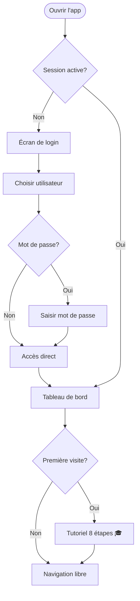
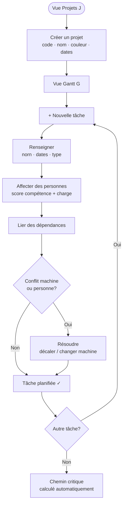
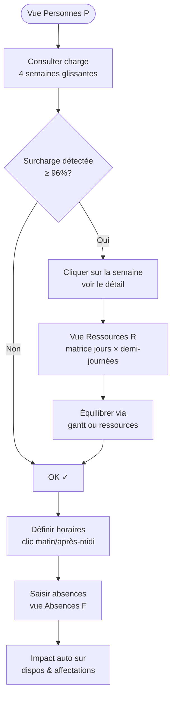
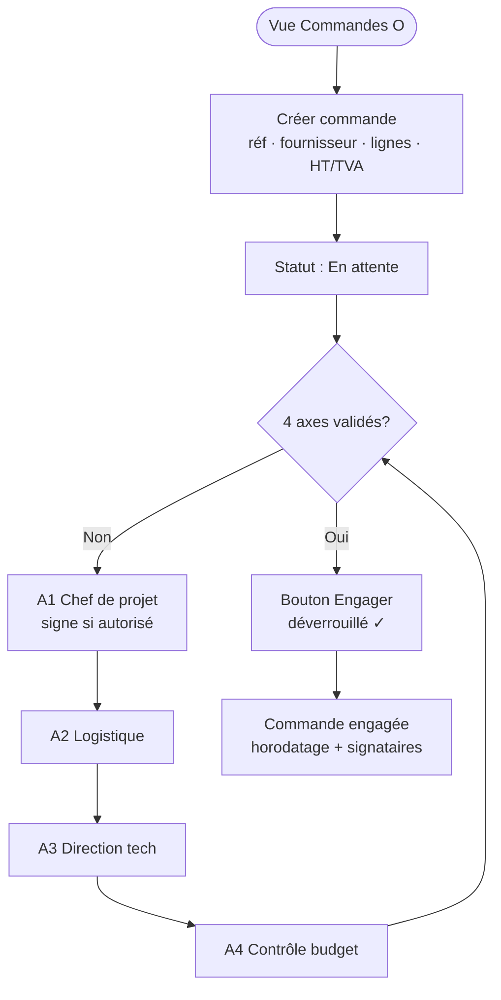
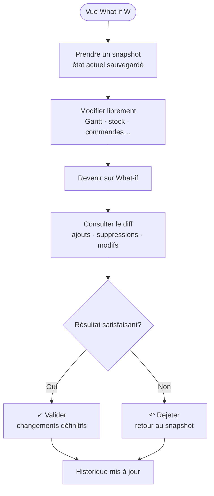
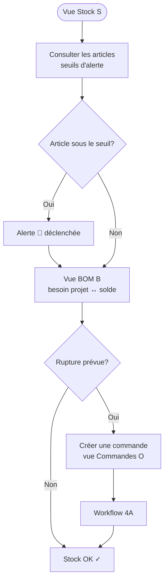
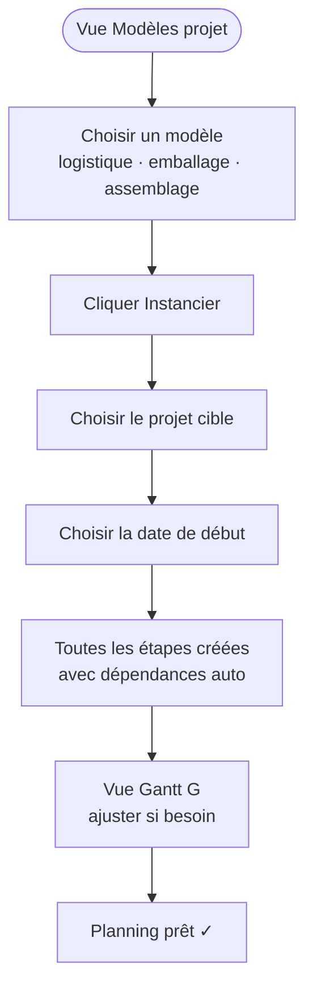

# Atelier — Planification

Application web de planification pour atelier multi-sites. Personnes, projets, machines, lieux de production, zones de stockage, stocks, BOM, déplacements, commandes avec workflow de validation 4A, prédictions et simulations.

**Zéro dépendance. Zéro installation. Un navigateur suffit.**

## Démarrage

**Option 1 — local (recommandé)**
Double-cliquer sur `index.html`. L'application s'ouvre dans le navigateur. Les données sont sauvegardées dans le `localStorage` (persistance locale au navigateur).

**Option 2 — serveur statique**
Copier `index.html`, `styles.css`, `app.js`, `data.js` et le dossier `views/` sur n'importe quel serveur statique (IIS, Apache, Nginx, GitHub Pages, Netlify…). Aucune configuration côté serveur.

**Option 3 — GitHub Pages**
Cette app est déployée automatiquement depuis la branche `main`.

## Modules (25 vues + Admin)

| Raccourci | Onglet | Contenu |
|:-:|---|---|
| `D` | Tableau de bord | KPI (absents, retards), conflits & alertes **cliquables** → navigation directe, donut avancement global, charge par personne, prédiction fin de projet, cartes réorganisables (admin) |
| `G` | Gantt | Vue chronologique, dépendances SVG, glisser-déposer, chemin critique, cascade auto, **minimap flottante**, **indicateur "Aujourd'hui" renforcé**, menu clic-droit, bannière conflit machine |
| `K` | Kanban | Colonnes À démarrer / En cours / En retard / Terminé, drag & drop d'avancement |
| `C` | Calendrier | Vues mois / semaine, événements colorés par projet |
| `P` | Personnes | Annuaire, charge 4 semaines, horaires hebdo cliquables, résolveur de surcharge |
| `L` | Lieux | Production + stockages arborescents par étage |
| `M` | Machines | Charge 7 jours, conflits, CRUD, export CSV |
| `U` | Flux atelier | **3 vues** : 🗺 Canvas libre · 🏊 Swim lanes (mini-Gantt par atelier, zoom 10 j/20 j/30 j) · 📊 Statuts kanban machines |
| `J` | Projets | Cartes avec **badge J-X** (jours restants/dépassés), avancement, rapport PDF, édition ressources |
| `S` | Stock | Articles, seuils d'alerte, édition inline |
| `B` | BOM | Bill of Materials : besoin projet ↔ solde stock, ruptures prévues |
| `V` | Déplacements | Mouvements entre sites, personnes, motifs |
| `O` | Commandes | Workflow 4A, TVA suisse, historique signé et horodaté |
| `X` | Capacité | Heatmap capacité sur 8 / 12 / 24 semaines (par lieu, machine ou personne) |
| `R` | Ressources | Matrice personnes × jours × demi-journées |
| `E` | Équipes | Slots de compétences, auto-affectation avec gestion des absences |
| `A` | Plan atelier | Vue bird's eye SVG 2D, coloration charge, dots personnes temps réel, drag admin |
| `F` | Absences | Saisie congés/maladies/formations, impact automatique sur dispos |
| `T` | Modèles | Templates de tâches instanciables en 1 clic |
| `H` | Historique | Journal d'audit 500 dernières actions |
| `W` | What-if | Snapshot, modifications, diff, commit ou rollback |
| `Y` | Ma journée | Planning personnel + **grille équipe 20 j.o.** imprimable A3 |
| | Timeline | Vue chronologique multi-projets |
| | Modèles projet | Séquences d'étapes réutilisables avec gestes catalogue |
| `I` | Guide | Mode d'emploi interactif avec parcours cliquables |
| ⚙ | Admin | Utilisateurs, groupes, permissions fonctionnelles + **accès aux 25 modules par groupe** |

## Fonctionnalités clés

### Planification intelligente
- **Dépendances visuelles** (SVG) entre tâches avec flèches orientées
- **Chemin critique** calculé par DP sur DAG pondéré, surligné en rouge
- **Cascade automatique** : déplacer une tâche décale ses dépendantes
- **Suggestions d'affectation** : score combinant compétence (+100), charge (-5/h), proximité géographique (+10)
- **Prédiction fin de projet** par ratio de vélocité (temps consommé / avancement)
- **Alertes proactives** : stock vs BOM, conflits machine, surcharge personne, retard projet
- **Notifications en tête** : cloche 🔔 avec badge compteur (rouge si critique), rafraîchie toutes les 30 s

### Ressources humaines : horaires, disponibilité, équipes
- **Profil de travail hebdomadaire** par personne (grille 7 jours × matin/après-midi)
- **Édition inline** : clic direct sur les carrés L/M/M/J/V/S/D dans la liste Personnes pour basculer matin ou après-midi, sauvegarde instantanée
- **Vue Ressources** (raccourci R) : matrice personnes × jours × demi-journées avec 3 états (vert = dispo, orange = occupé·e, hachuré = off), filtres lieu/compétence/dispo aujourd'hui
- **Équipes** (raccourci E) : 7 équipes par défaut (Ligne 1-2, Valmont, Logistique 1-3, Assemblage) composées de slots de compétences (ex. 1×Contrôle + 7×Montage)
- **Pré-remplissage d'équipe** : depuis le formulaire d'une tâche Gantt, bouton « 🎯 Appliquer l'équipe » qui affecte automatiquement les N meilleures personnes par slot selon compétences + horaires + charge
- **Détection de conflit** : si une personne proposée est déjà sur une tâche chevauchante, popup avec choix individuel « Déplacer ici » (retire de l'autre tâche) ou « Ignorer »

### Plan 2D interactif de l'atelier
Vue **Plan** (raccourci A) : représentation bird's eye SVG de tous les lieux positionnés par étage.

- **Coloration automatique** selon la charge sur 5 j. ouvrés : 🟢 ≤50 % / 🟡 ≤80 % / 🟠 ≤95 % / 🔴 >95 %
- **Dots personnes** : chaque personne ayant une tâche active aujourd'hui apparaît comme un cercle coloré dans le lieu concerné (tooltip avec nom/rôle)
- **Icône** selon le type (🛠 production / 📦 stockage)
- **Filtres pills** pour isoler un étage
- **Panel détail** au clic : charge en j-personne, liste des personnes présentes, tâches prévues sur 5 j avec badges projet
- **Mode édition admin** : cocher « Mode édition » → drag des rectangles à la souris, positions sauvegardées en direct. Bouton « Réorganiser auto » pour revenir à la grille par défaut.

### Authentification par mot de passe
Login au démarrage avec SHA-256 (Web Crypto API). Un utilisateur sans mot de passe défini n'a pas de challenge (accès direct). Un admin (⚙) peut définir/retirer les mots de passe de tous les utilisateurs. Chaque utilisateur peut gérer son propre mot de passe via 🔑.

> ⚠ **Limitation** : app statique sans backend. Les hashes sont stockés en `localStorage`, donc un utilisateur avec devtools peut contourner. Verrou visuel efficace contre l'usage non-technique, mais pas une vraie sécurité.

### Utilisateurs & groupes d'accès
3 groupes avec **permissions fonctionnelles + accès aux modules paramétrables** (vue Admin ⚙) :

| Groupe | Lecture | Édition | Signer 4A | Engager | What-if | Reset | Admin |
|---|:-:|:-:|:-:|:-:|:-:|:-:|:-:|
| **utilisateur** | ✓ | | | | | | |
| **MSP** | ✓ | ✓ | ✓ (axes attribués) | ✓ | ✓ | | |
| **admin** | ✓ | ✓ | ✓ (tous axes) | ✓ | ✓ | ✓ | ✓ |

Les boutons marqués `data-perm` se masquent automatiquement selon le groupe. L'historique 4A enregistre le nom du signataire et l'horodatage ISO.

**Accès aux modules** : 25 modules organisés en 4 catégories (Navigation, Organisation, Production, Suivi). L'admin coche/décoche chaque module par groupe dans la section "Accès aux modules" de la vue Admin. L'Admin a toujours tout accès. Les boutons de navigation disparaissent instantanément sans rechargement.

Utilisateurs par défaut (éditables dans la vue Admin) :

| Nom | Rôle | Groupe | Axes 4A |
|---|---|---|---|
| Alice Chef-Projet | Chef de projet | MSP | A1 |
| Bruno Logistique | Logistique | MSP | A2 |
| Carla Tech | Direction technique | MSP | A3 |
| David Budget | Contrôle budget | MSP | A4 |
| Elena Direction | Direction | admin | tous |
| Frank Observateur | Consultation | utilisateur | — |

### Mode d'emploi interactif
Au premier démarrage, un **tutoriel 8 étapes** s'affiche (bienvenue, navigation, groupes, Gantt, stock/BOM, 4A, alertes, prêt). Accessible ensuite via le bouton 🎓 dans la topbar.

### Édition inline
Les quantités du **BOM** et du **stock** sont modifiables directement dans les tableaux (Entrée ou blur pour valider). Une quantité BOM à 0 propose la suppression de la ligne.

### Absences & congés (vue F)
Saisie des absences par personne (vacances, maladie, formation, récup, autre) avec période et note.
- **Impact automatique** sur la vue Ressources (cellule hachurée violette)
- **Pénalisation dans l'auto-affectation équipe** : les personnes absentes sur la période de la tâche sont dépriorisées (score −20/jour)
- KPI : absents aujourd'hui / semaine / 2 semaines à venir
- Filtres personne, motif, inclure les passées

### Modèles de tâches récurrentes (vue T)
Créer un **template de tâche** (nom, type, durée, machine, lieu, compétences, notes, couleur) qu'on peut dupliquer en 1 clic. Utile pour les tournées, préparations et activités qui reviennent régulièrement. Le bouton « ➕ Utiliser » demande le projet et la date de début, crée la tâche et ouvre le Gantt.

### Historique des modifications (vue H)
**Journal d'audit** automatique sur create/update/delete des tâches, projets, absences, modèles. Les 500 dernières actions sont conservées avec :
- Horodatage précis
- Utilisateur ayant fait l'action
- Type d'entité (tâche, projet, absence, modèle…)
- Nature de l'action (create / update / delete)
- Détails (nom de l'entité modifiée)

Filtres par type, action, utilisateur, recherche plein texte. Purge admin.

### Export CSV enrichi
- **Planning hebdomadaire CSV** (bouton dans vue Personnes) : une ligne par personne × jour de la semaine avec tâches, déplacements, absences, heures travaillées
- **Tâches projet CSV** (bouton dans formulaire projet) : toutes les tâches du projet avec dates, avancement, personnes, dépendances, notes
- **CSV Excel-compatible** : BOM UTF-8, séparateur `;`, accents préservés
- Téléchargement direct sans plugin

### Mode mobile atelier
Interface optimisée pour **téléphone & petit tablet** (< 720 px) :
- Topbar compacte avec navigation horizontale scrollable
- Tables scrollables en X
- Modales en quasi plein-écran
- Boutons d'action secondaires masqués (export, import, reset) en dessous de 480 px

### Édition visuelle des ressources dans les projets
Depuis l'onglet **Projets**, en ouvrant un projet :
- Chaque tâche affiche ses personnes en **chips colorées** (couleur de la personne) avec **× pour retirer**
- **Sélecteur « + Ajouter personne »** par tâche (filtré sur non-assignées)
- **Bouton « 💡 Suggérer »** par tâche : top 5 scoré par compétence (+100) + lieu (+10) − charge (−5/j)
- **Bouton « 🎯 Auto-affecter équipe »** au niveau projet : choisir une équipe → répartit automatiquement les personnes sur toutes les tâches non-jalon selon les slots de compétences, en conservant les affectations existantes

### Navigation contextuelle (« clic → source »)
Toutes les fenêtres d'information ont des **lignes cliquables** avec chevron **›** :
- **🔔 Alertes proactives** : clic sur une alerte → ouvre la vue concernée et le formulaire de l'élément (projet en retard, tâche en conflit, personne surchargée, BOM en rupture)
- **Tableau de bord** : carte « Conflits » et « Prochaines tâches » cliquables
- **Ma semaine** (Personnes) : clic sur une tâche ou un déplacement → navigue vers la vue
- **Calendrier** : détail jour → clic sur tâche ouvre le formulaire dans le Gantt
- **Plan 2D** : panneau détail → clic personne/tâche ouvre la fiche
- **Suggestions** (Gantt) : clic sur le nom → ouvre la fiche personne
- **Recherche globale** (Ctrl+K) : Entrée ou clic → ouvre le formulaire de l'entité sélectionnée

### Recherche globale (Ctrl+K / Cmd+K)
Barre de recherche instantanée à travers personnes, projets, articles, commandes, tâches, machines, lieux. Navigation au clavier (↑↓), Entrée pour ouvrir directement le formulaire de l'élément sélectionné.

### Menu contextuel Gantt
Clic-droit sur une barre Gantt → menu d'actions rapides :
- Éditer / Dupliquer / Supprimer
- Marquer terminée (100 %) / 50 % / 0 %
- Suggérer des personnes (liste scorée avec bouton Affecter)

### Undo / Redo
- **Ctrl+Z** / **Cmd+Z** : annuler la dernière action
- **Ctrl+Shift+Z** / **Cmd+Shift+Z** : refaire

Historique des 20 dernières modifications en mémoire (non persistant entre sessions).

### Rapport PDF projet
Bouton **⎙ Rapport** sur chaque carte projet. Ouvre une fenêtre A4 paysage avec :
- KPI (avancement, tâches, budget HT, budget TTC)
- Prédiction de fin avec écart en jours et vitesse d'exécution
- Gantt simplifié en barres horizontales
- BOM avec ruptures détectées
- Liste des commandes avec totaux
- Impression automatique déclenchée au chargement

### Ma semaine (planning personnel)
Bouton 📅 sur chaque ligne de la vue **Personnes**. Modale récapitulative avec :
- Cette semaine + semaine prochaine
- Tâches colorées par projet avec dates et lieux
- Déplacements prévus
- Charge en heures avec barre de remplissage
- Imprimable pour affichage atelier

### Workflow 4A (« 4A n'engage pas la commande »)
Une commande doit être validée par les 4 axes obligatoires avant engagement :

- **A1** — Chef de projet
- **A2** — Logistique
- **A3** — Direction technique
- **A4** — Contrôle budget

Tant que les 4 cases ne sont pas cochées, le bouton **Engager** reste inaccessible. Chaque cochage/décochage est **journalisé** (valideur + horodatage ISO). Les intitulés sont personnalisables dans `state.regle4A.axes`.

### Détection de conflits (automatique)
- **Personnes** — même personne sur des tâches qui se chevauchent
- **Machines** — même machine utilisée simultanément
- **Stock** — articles sous le seuil d'alerte
- **Commandes** — demandes sans validation 4A complète

Les tâches en conflit sont cerclées de rouge dans le Gantt.

### Devises & TVA suisse
Montants affichés en **CHF** (format suisse). TVA au taux standard **8.1 %** avec calcul HT / TVA / TTC.

### Import / Export
- **Exporter** télécharge un JSON daté (`atelier-plan-YYYY-MM-DD.json`)
- **Importer** remplace les données par un fichier JSON
- **Reset** recharge le jeu de démonstration
- **Impression** (⎙) génère un PDF A4 paysage via `@media print`
- **Rapport projet** (⎙ Rapport sur une carte) génère un PDF dédié par projet
- **Export CSV** disponible pour commandes, machines, stock, planning

### Mode tablette
Bouton 📋 : interface agrandie en lecture seule avec rafraîchissement automatique, pour écran d'atelier.

### Thème clair / sombre
Bouton ☾ / ☀ : bascule instantanée, persisté en localStorage.

## Raccourcis clavier

| Touche | Action |
|:-:|---|
| `D` `G` `C` `P` `L` `M` `J` `S` `B` `V` `O` `X` `W` | Navigation directe vers un onglet |
| `N` | Nouvel élément (dans la vue courante) |
| `/` | Focus sur la barre de recherche de la vue |
| `Ctrl+K` / `Cmd+K` | **Recherche globale** (toutes entités) |
| `Ctrl+Z` / `Cmd+Z` | **Annuler** la dernière modification |
| `Ctrl+Shift+Z` | **Refaire** |
| `R` | Vue Ressources |
| `E` | Vue Équipes |
| `A` | Vue Plan atelier |
| `F` | Vue Absences |
| `T` | Vue Modèles de tâches |
| `H` | Vue Historique |
| `?` | Afficher l'aide des raccourcis |
| `Esc` | Fermer la modale / la recherche |

> Sur macOS, les raccourcis fonctionnent avec `Cmd` à la place de `Ctrl`.

## Données de démonstration

- **70 personnes** — rôles, compétences, lieu principal, capacité hebdomadaire
- **7 lieux de production** sur 3 étages (2e, 1er, Rez)
- **12 zones de stockage** (arrivages, expédition, tampons, matières, consommables, outillage, prototypes, produits chimiques)
- **10 machines** — CNC, laser, plieuses, soudure, peinture, montage, bancs de test
- **6 projets** en parallèle, tâches auto-générées avec jalons et dépendances
- **12 articles de stock** — seuils d'alerte, projets liés, BOM
- **Commandes** — fournisseurs suisses, workflow 4A, TVA 8.1 %

## Architecture

```
index.html          Shell + topbar + modal root + script tags
styles.css          Thème clair/sombre, grille Gantt, heatmap, print,
                    recherche globale, menu contextuel, tutorial
data.js             DB, seed, migrate, undo/redo, utilitaires dates
                    (UTC), calculs CHF/TVA, export CSV
app.js              Router, modal, toast, raccourcis, conflits,
                    suggestions, prédictions, alertes proactives,
                    permissions (can/applyPerms), recherche globale,
                    tutorial
views/
  dashboard.js      KPI + conflits + alertes + prédictions + charge
                    + cartes réorganisables par drag & drop (admin)
  gantt.js          Grille CSS + overlay SVG + drag-to-reschedule
                    + menu contextuel clic-droit + pré-remplissage équipe
                    + popup conflit d'affectation
  calendrier.js     Mois / semaine
  personnes.js      Annuaire + charge 4 semaines + Ma semaine
                    + horaires cliquables en ligne
  lieux.js          Arbres de stockage par étage
  machines.js       CRUD + charge + export CSV
  projets.js        Cartes + rapport PDF
  stock.js          Articles + seuils + édition inline
  bom.js            Bill of Materials projet ↔ stock + édition inline
  deplacements.js   Liste + création
  commandes.js      4A + historique signé + autorisation par axe
  capacite.js       Heatmap
  ressources.js     Matrice personnes × jours × demi-journées
  equipes.js        CRUD équipes + slots compétences + proposerAffectation
  plan.js           Plan 2D SVG bird's eye, charge, dots personnes, drag admin
  absences.js       Saisie des absences + KPI + filtres + impact auto
  modeles.js        Templates de tâches récurrentes + instanciation
  audit.js          Journal d'audit 500 dernières actions
  whatif.js         Snapshot + diff + commit
  admin.js          Gestion utilisateurs, groupes, permissions, mots de passe
```

**Persistance** : `localStorage['atelier_plan_v3']`. Le numéro de version (`v3`) est incrémenté lorsque le modèle de données évolue, pour invalider les anciennes sauvegardes. Les ajouts rétrocompatibles passent par `DB.migrate()` afin de préserver les données existantes.

**Dates en UTC** : toutes les manipulations de date passent par `D.parse`, `D.iso`, `D.addDays`, etc. qui utilisent `Date.UTC()` et `getUTCDate()`. Cela évite les décalages d'un jour lors d'un changement d'heure ou d'un fuseau non-UTC (bug historique en CEST/Zurich).

## Flux d'utilisation

### 1 — Connexion & démarrage



---

### 2 — Planifier un projet



---

### 3 — Gérer les ressources humaines



---

### 4 — Workflow commande 4A



---

### 5 — Simulation What-if



---

### 6 — Gestion stock & BOM



---

### 7 — Modèle de projet réutilisable



---

## Utilisation & contact

| | |
|---|---|
| **Responsable** | Davie MARET — MSP |
| **Institution** | EPI — Atelier Conditionnement & Logistique |
| **Site** | Genève |
| **Email** | [davie.maret@epi.ge.ch](mailto:davie.maret@epi.ge.ch) |
| **Téléphone** | 022 |
| **Contexte** | Planification d'atelier de production multi-sites |
| **Version** | 3.9 |
| **Date** | Avril 2026 |

Pour toute question relative à l'utilisation de cette application, contacter **Davie MARET** (MSP, Atelier Conditionnement & Logistique — EPI Genève) : [davie.maret@epi.ge.ch](mailto:davie.maret@epi.ge.ch)

## Licence & crédits

Application développée sur mesure pour **Davie MARET** — MSP à l'Atelier Conditionnement & Logistique des EPI (Genève). Aucune dépendance tierce.
